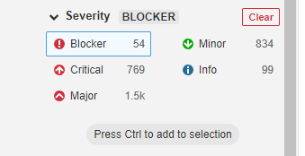
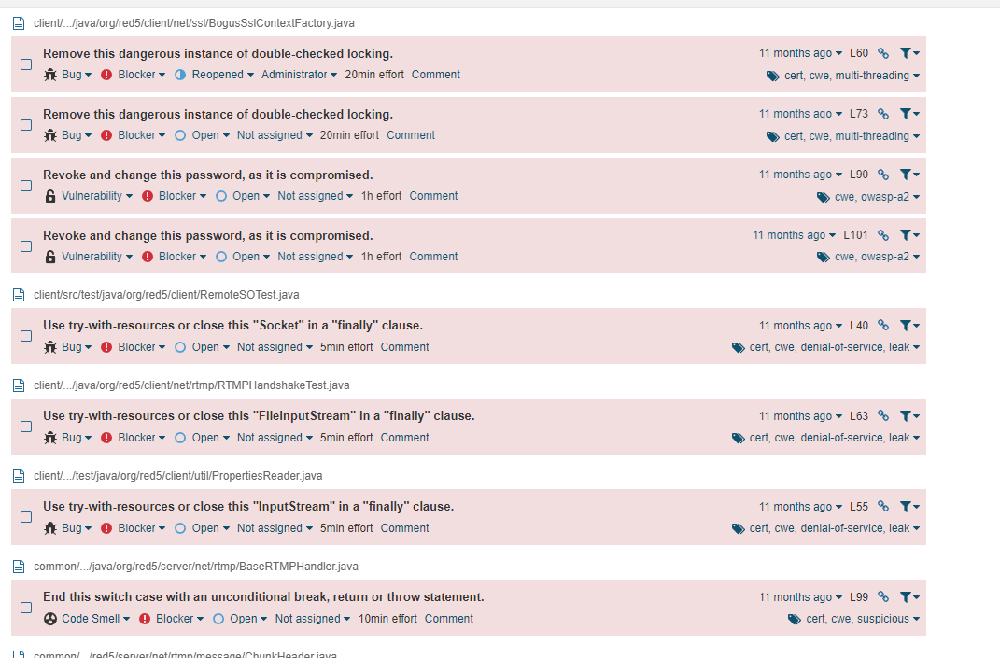
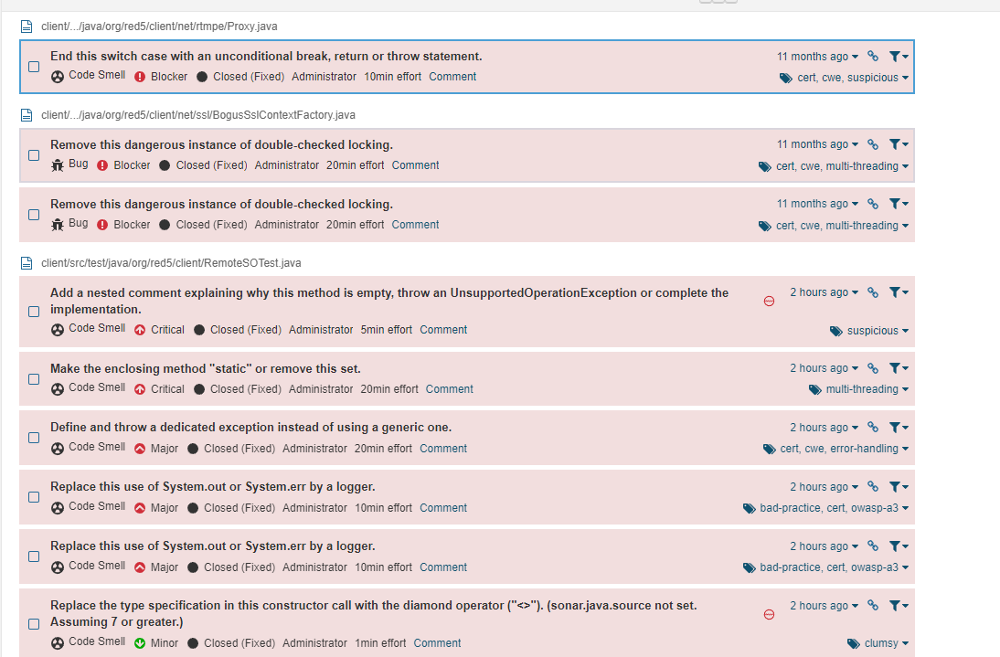
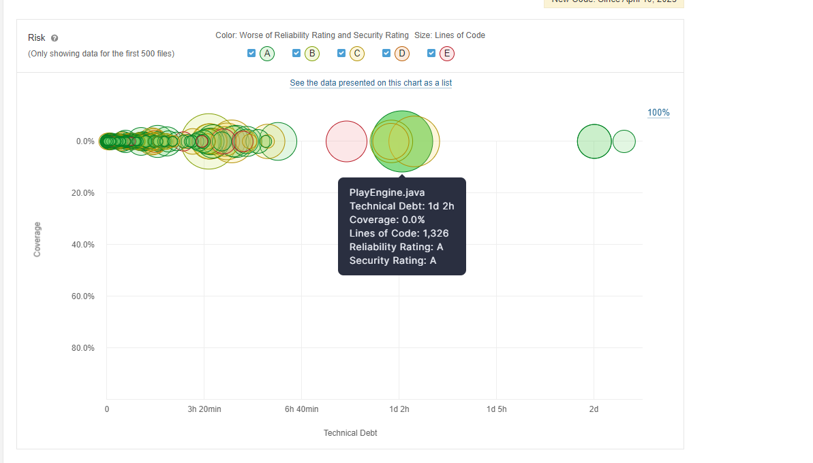
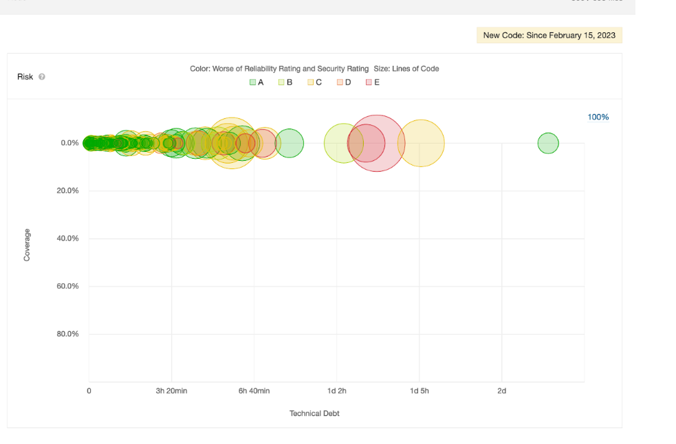
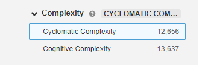

# Réalisation de l'amélioration du code du projet Red-5 Server
Réalisé par ROUABAH Walid  
Lien du github du projet : https://github.com/Walid59/red5-server

## Sommaire

#### I. Résolution de certaines issues
#### II. Tentative de diminution de la complexité cyclomatique & cognitive (dont du refractoring)
#### III. Conclusion

### I. Résolution de certaines issues
on peut par exemple essayer de retirer un maximum de blocker:

Voici la liste de quelques issues qui ont été réglées, la plupart étant comme blocker et critical : 

Après la résolution de la plupart de ces problèmes (42 fixed selon Sonar), voici le nouveau graphique depuis celui montré dans la partie 1 du projet : 

On remarque ici que la plupart des classes, et plus particulièrement playEngine sont devenus verts car les problèmes relatifs aux bugs ont tous étés reglés. La taille du cercle reste très gros car il y a beaucoup de lignes de code, ce qui est normal.  

Pour rappel, voici l'image avant modification:  
  
Concernant FLVWriter, (le cercle rouge à côté de PlayEngine.java), il n'a pas été traité car la majorité des bugs sont issus d'un problème de trycatch, où soit on doit réaliser une fermeture de stream (qui a déjà été fait dans un autre fichier), ou soit on doit gérer des exceptions qui ne l'ont pas été.

### II. Tentative de diminution de la complexité cyclomatique & cognitive  

Maintenant, intéressons nous à la complexité cyclomatique et cognitive. Pour rappel, le code au total contient une complexité relativement élevée :

Nous allons voir s'il y a des fichiers en particulier qu'on peut rendre moins complexe.

Pour rappel, voici quelques chiffres concernant la complexité cyclomatique & cognitive  :

Bien que ces chiffres ne soient pas parlants - car elles correspondent a la somme de la complexité de chaque fichier - , nous allons essayer de diminuer ces 2 valeurs en nous concentrant sur des fichiers particuliers.  

On peut par exemple en essayant de minimiser les conditions dans la classe StreamRelay.java de refractorer le main : pour cela, on créer plein de petites méthodes qui auront chacun leur rôle.  
Pour résumer : pour chaque tache = une méthode (sauf s'il y en a vraiment pas besoin)  
-> Permet de débugger plus facilement s'il y a un problème  
-> Permet de se retrouver plus facilement dans le code si on cherche une tache particulière  
Je vous invite donc à voir la méthode StreamRelay.java refractorée.

Il semble que la complexité n'ait pas diminué. Je vois difficilement comment faire, mais au moins à la place j'ai pu "découper" le main de cette classe.
De plus, je ne peux pas tester le code, donc je ne sais pas s'il fonctionne ou pas.

Un tag de toutes les réalisations a été créée.

## CONCLUSION

Dans ce module, j'ai appris énormément de choses. Je ne connaissais pas toutes ces notions de TDD, BDD, code smells, etc. & et j'ai énormément appris sur l'analyse d'un projet, et plus particulièrement en terme de smell code, refractoring, utilisation & organisation de classes (ex: design pattern cohérent?). J'ai aussi appris à quel point il était utile et très puissant d'avoir à côté des outils comme Sonarqube qui permettent de voir à quel point n'importe quoi peut avoir un impact positif ou négatif sur le code. Outil que je n'utilisais pas avant mais que j'utiliserai très certainement dans mes futurs projets.  

Concernant ce projet, bien que j'estime avoir quand même travaillé dessus, je trouve que la partie 2 est insatisfaisante pour moi dans le sens où je trouve que je n'ai pas réussi à réaliser de grands changement au niveau du code car j'ai du mal à trouver de grosses parties où il fallait beaucoup changer de code. Je n'ai pas trouvé par exemple de groupe de classes (ou une seule) à refractorer de manière à créer un design pattern comme le visiteur ou le composite par exemple. Je n'ai pas non plus réussi à diminuer la complexité cyclomatique car ce n'était pas évident pour moi de pouvoir réduire des conditions qui, je l'estimais, importantes.  
Au moins j'ai quand même pas mal appris que ce soit au niveau des notions, au niveau de l'analyse et de la compréhension du code, l'usage de Sonarqube, etc.
